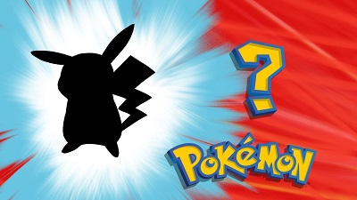

# :8ball: Pokémon Guessing Game

Welcome to the Pokemon guessing game!

The computer will randomly choose a pokemon name. For simplicity's sake, we will use only first generation's 151 pokemon.
The goal of the game is to guess correctly the name which was randomly chosen.
If the guessed letter exists in the pokemon's name, it will be marked in all the correct spots within the word.
Guessing will continue until the word is guessed completely.
Valid input is only a single alphabet letter. For example: 'Q' or 'q'.

*Gotta guess 'em all! (╯°□°)╯︵◓*

All Pokémon names are owned by Nintendo.
